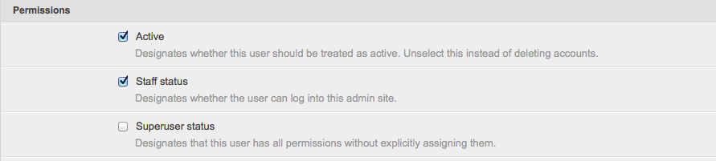
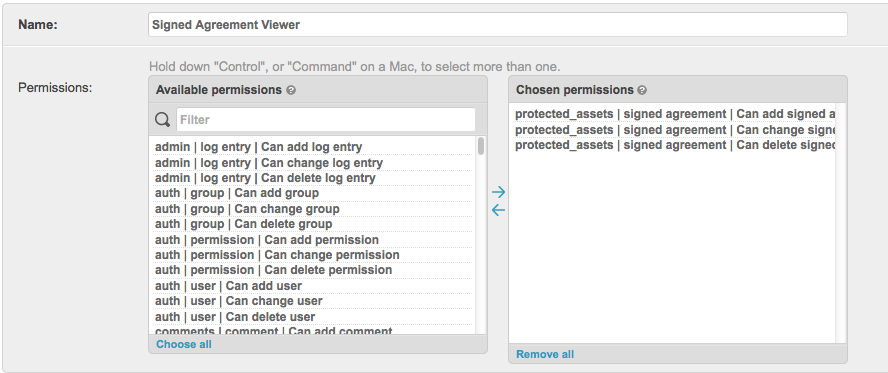
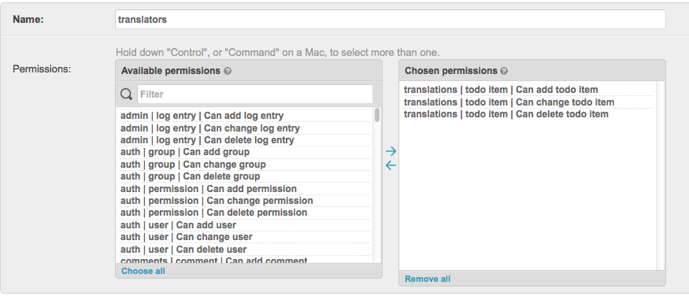
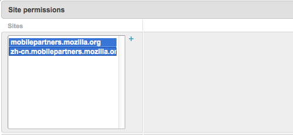

.. This Source Code Form is subject to the terms of the Mozilla Public
.. License, v. 2.0. If a copy of the MPL was not distributed with this
.. file, You can obtain one at http://mozilla.org/MPL/2.0/.

.. _groups-permissions:

Groups & Permissions
====================

Below you will find documentation on groups and permissions levels.

Granting Admin Permissions
---------------------------------

Users who need to access the admin must have the following permissions:

Groups: Content Author
------------------------
This group grants the user permission to edit most of the
content (Pages, Forms, Media) within the admin.

Groups: Signed Agreement Viewer
---------------------------------

Granted to people who need to be able to view the signed agreements. The permissions
for this group are shown below:

Groups: Translators
---------------------

Granted to people who need to perform translations. This  grants users permissions
to access/edit Rosetta and ToDos. The permissions for this group are shown below:

**You must manually add users to each site they need to translate.**

.. Important::
    When adding translators in addition to adding them to the correct group
    you must also select all the sites they need to access. Translators must be
    given access to the US site to view that content.

